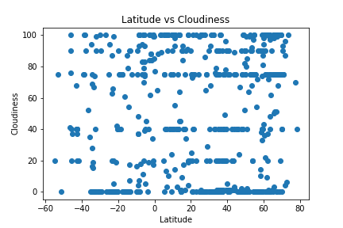
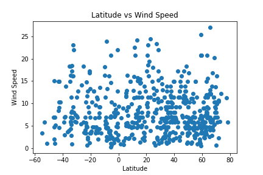
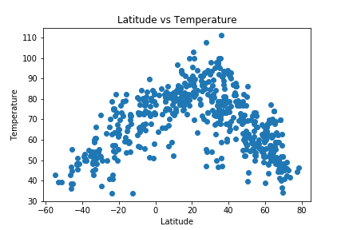
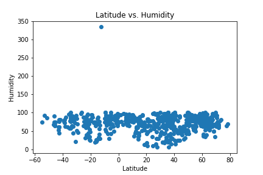

# Python-Weather-Analysis-Using-APIs
Python script to visualize the weather of 500+ cities across the world using citipy and the OpenWeatherMap API

Built a series of scatter plots to showcase the following relationships:

* Temperature (F) vs. Latitude
* Humidity (%) vs. Latitude
* Cloudiness (%) vs. Latitude
* Wind Speed (mph) vs. Latitude

* Randomly selected 500 unique (non-repeat) cities based on latitude and longitude.
* Performed a weather check on each of the cities using a series of successive API calls.
* Includes a print log of each city as it's being processed with the city number and city name.
* Saved both a CSV of all data retrieved and png images for each scatter plot.

*Uses Matplotlib, Pandas, and numpy

